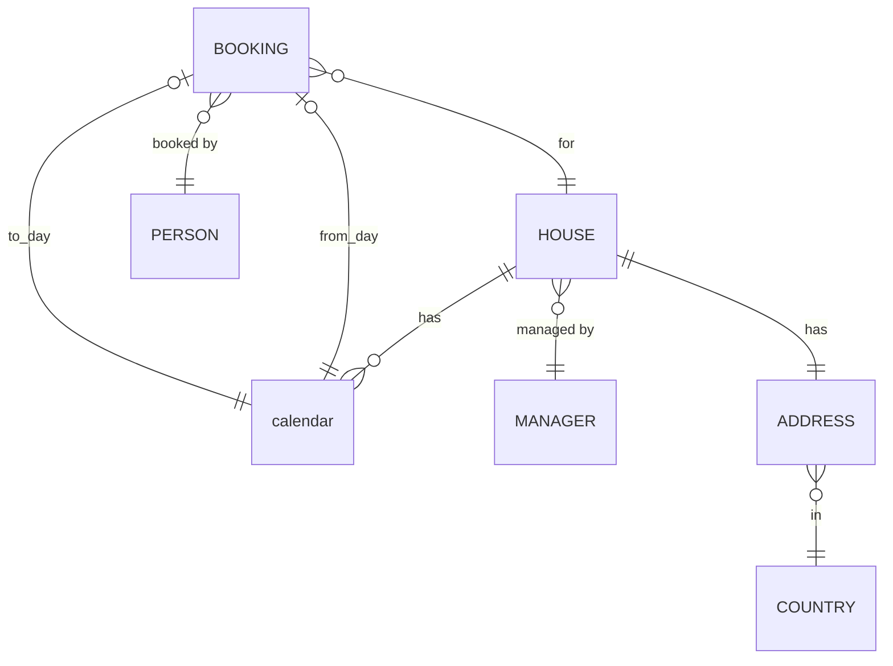

# Domain overview

## General rules

- Each table of each domain has a unique technical ID
- All fields are mandatory, except optional is explicitly specified

## Relationships

## Entities 

- House
  - Name
  - Address of house
  - Description of house
- Address
  - Street name
  - House number
  - Postcode
  - City / Town
  - Province (optional)
- Country
  - Name
  - ISO Code
- Manager managing a house
  - First name
  - Last name
  - Email
  - Phone number
- Person renting a house
  - First name
  - Last name
  - Email
  - Phone number
- calendar per house 
  - Date 
  - Renting status for date (day / month / year)
    - Not rentable (default)
    - Rentable (free)
    - Rented (booked)
  - Price at day
- Booking
  - Date paid at (optional)
  - Total price paid (optional - set together with Date paid)
  - Status (Active, Cancelled)

  